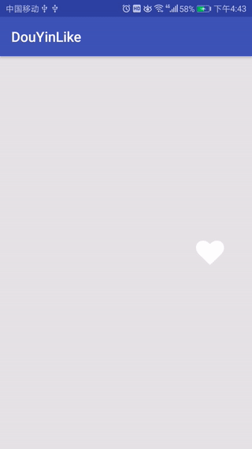
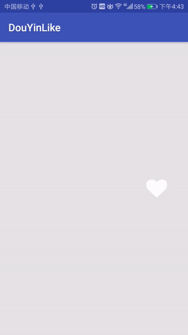

# 仿抖音APP的点赞效果

### 点赞效果

抖音的点赞效果是由右侧的桃心点赞和屏幕的点击构成，右侧的点击后为点赞状态并有点赞动画，再次点击取消点赞。

### 先来看看效果：


此处我们观察效果基本和此前用过的一个三方库比较相似，此处就先又此代替，后面有时间再进行完善。
该库为[Like Button](https://github.com/jd-alexander/LikeButton),使用方式很简单，如下：
```xml
<com.like.LikeButton
    android:id="@+id/likeBtn"
    android:layout_width="wrap_content"
    android:layout_height="wrap_content"
    android:layout_alignParentRight="true"
    android:layout_centerVertical="true"
    app:icon_size="40dp"
    app:icon_type="heart"
    app:like_drawable="@mipmap/ic_heart_on"
    app:unlike_drawable="@mipmap/ic_heart_off" />
```
**LikeButton**具有以下属性,使用时可自行去查看
```xml
<com.like.LikeButton
    app:icon_type="Star"
    app:circle_start_color="@color/colorPrimary"
    app:like_drawable="@drawable/thumb_on"
    app:unlike_drawable="@drawable/thumb_off"
    app:dots_primary_color="@color/colorAccent"
    app:dots_secondary_color="@color/colorPrimary"
    app:circle_end_color="@color/colorAccent"
    app:icon_size="25dp"
    app:liked="true"
    app:anim_scale_factor="2"
    app:is_enabled="false"/>
```
设置**LikeButton**的监听事件：
```kotlin
likeBtn.setOnLikeListener(object : OnLikeListener {
    override fun liked(p0: LikeButton?) {
        toast("已点赞~~")
    }

    override fun unLiked(p0: LikeButton?) {
        toast("取消点赞~~")
    }

})
```

### 我们可以看一下点赞按钮的点赞效果


和抖音的还是有点区别的，后续完善

### 屏幕点赞

分析抖音的屏幕点赞由几个部分组合而成（红心可自绘，也可以直接使用图片）
> 1、刚开始显示的时候，有个由大到小缩放动画

> 2、透明度变化

> 3、向上平移 

> 4、由小到大的缩放

> 5、刚开始显示的时候有个小小的偏移，避免每个红心在同一个位置

#### 实现过程
获取红心
```kotlin
private var icon: Drawable = resources.getDrawable(R.mipmap.ic_heart)
```
监听Touch事件，并在按下位置添加View
```kotlin
override fun onTouchEvent(event: MotionEvent?): Boolean {
    if (event?.action == MotionEvent.ACTION_DOWN) {     //按下时在Layout中生成红心
        val x = event.x
        val y = event.y
        addHeartView(x, y)
        onLikeListener()
    }
    return super.onTouchEvent(event)
}
```
为红心添加一个随机的偏移（此处为-10~10）
```kotlin
img.scaleType = ImageView.ScaleType.MATRIX
val matrix = Matrix()
matrix.postRotate(getRandomRotate())       //设置红心的微量偏移
```
设置一开始的缩放动画
```kotlin
private fun getShowAnimSet(view: ImageView): AnimatorSet {
    // 缩放动画
    val scaleX = ObjectAnimator.ofFloat(view, "scaleX", 1.2f, 1f)
    val scaleY = ObjectAnimator.ofFloat(view, "scaleY", 1.2f, 1f)
    val animSet = AnimatorSet()
    animSet.playTogether(scaleX, scaleY)
    animSet.duration = 100
    return animSet
}
```
设置慢慢消失时的动画
```kotlin
private fun getHideAnimSet(view: ImageView): AnimatorSet {
    // 1.alpha动画
    val alpha = ObjectAnimator.ofFloat(view, "alpha", 1f, 0.1f)
    // 2.缩放动画
    val scaleX = ObjectAnimator.ofFloat(view, "scaleX", 1f, 2f)
    val scaleY = ObjectAnimator.ofFloat(view, "scaleY", 1f, 2f)
    // 3.translation动画
    val translation = ObjectAnimator.ofFloat(view, "translationY", 0f, -150f)
    val animSet = AnimatorSet()
    animSet.playTogether(alpha, scaleX, scaleY, translation)
    animSet.duration = 500
    return animSet
}
```
设置动画关系，并且在动画结束后Remove该红心
```kotlin
val animSet = getShowAnimSet(img)
val hideSet = getHideAnimSet(img)
animSet.start()
animSet.addListener(object : AnimatorListenerAdapter() {
    override fun onAnimationEnd(animation: Animator?) {
        super.onAnimationEnd(animation)
        hideSet.start()
    }
})
hideSet.addListener(object : AnimatorListenerAdapter() {
    override fun onAnimationEnd(animation: Animator?) {
        super.onAnimationEnd(animation)
        removeView(img)     //动画结束移除红心
    }
})
```


